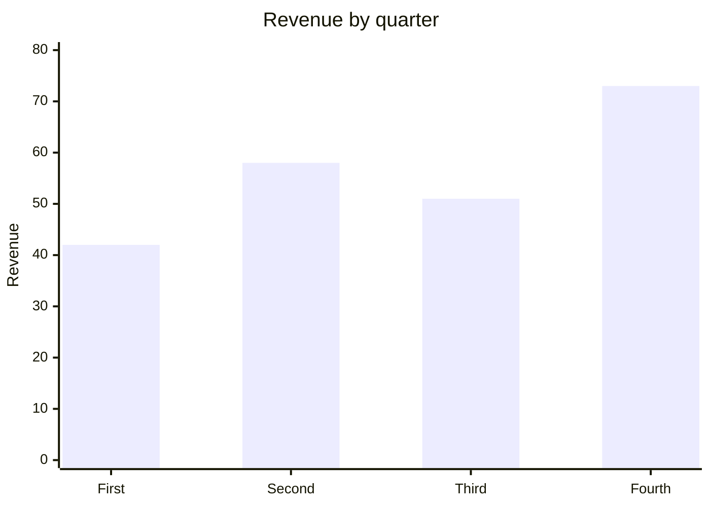
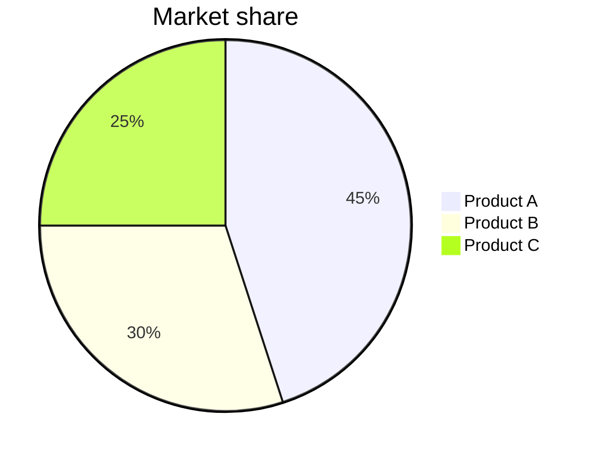

# Accessible Charts Sample

Every chart in this sample follows the text twin rule: the drawing, the
data behind it, and a sentence of description travel together. Preview
this document in the web browser to see the drawn charts. Under a
screen reader, each chart reads as structured text right here in the
source, and each data table reads as a real table after conversion.
Nothing in this document needs Node or Python: the browser draws the
mermaid charts, and the SVG chart is hand-written text.

## Quarterly revenue as a table

The table is the foundation. It alone satisfies the alternative text
rule from the accessibility guidelines: a table of the data presented
in a chart serves the equivalent purpose.

| Quarter | Revenue |
| --- | --- |
| First | 42 |
| Second | 58 |
| Third | 51 |
| Fourth | 73 |

## The same data as a bar chart

Revenue rose over the year, dipping slightly in the third quarter and
finishing strongest in the fourth.



## The same data as a line chart

The line form emphasizes the trend rather than the individual amounts.

```mermaid
xychart-beta
    title "Revenue trend"
    x-axis [First, Second, Third, Fourth]
    y-axis "Revenue" 0 --> 80
    line [42, 58, 51, 73]
```

## Market share as a pie chart

Three products split the market, with the first holding nearly half.



## A hand-written SVG bar chart

SVG is itself a plain text language, so a chart can be authored
character by character in the editor. The title and desc elements
inside the SVG are read by screen readers in the browser, and the same
file drives a braille embosser for a tactile copy.

<svg xmlns="http://www.w3.org/2000/svg" viewBox="0 0 400 220" role="img" aria-labelledby="chartTitle chartDesc">
  <title id="chartTitle">Revenue by quarter</title>
  <desc id="chartDesc">Bar chart of quarterly revenue: First 42, Second 58, Third 51, Fourth 73. Revenue rose over the year with a small dip in the third quarter.</desc>
  <rect x="40"  y="136" width="60" height="64"  fill="#336699" />
  <rect x="130" y="104" width="60" height="96"  fill="#336699" />
  <rect x="220" y="118" width="60" height="82"  fill="#336699" />
  <rect x="310" y="74"  width="60" height="126" fill="#336699" />
  <text x="70"  y="215" text-anchor="middle" font-size="12">First</text>
  <text x="160" y="215" text-anchor="middle" font-size="12">Second</text>
  <text x="250" y="215" text-anchor="middle" font-size="12">Third</text>
  <text x="340" y="215" text-anchor="middle" font-size="12">Fourth</text>
  <text x="70"  y="130" text-anchor="middle" font-size="12">42</text>
  <text x="160" y="98"  text-anchor="middle" font-size="12">58</text>
  <text x="250" y="112" text-anchor="middle" font-size="12">51</text>
  <text x="340" y="68"  text-anchor="middle" font-size="12">73</text>
</svg>
