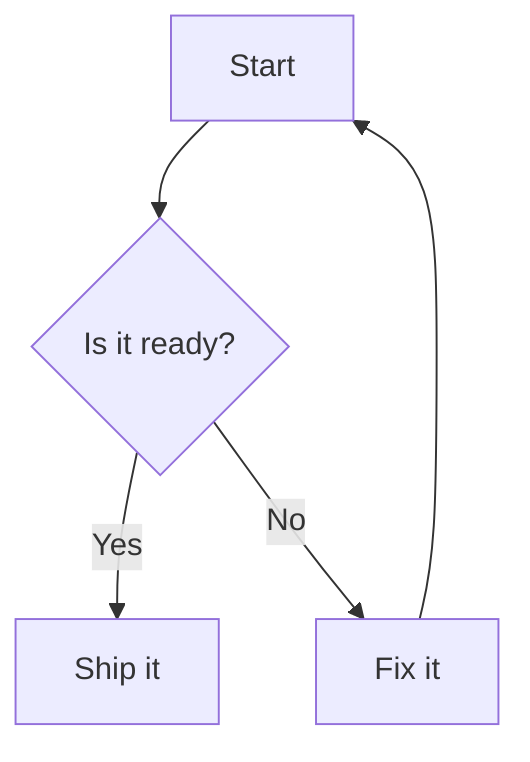
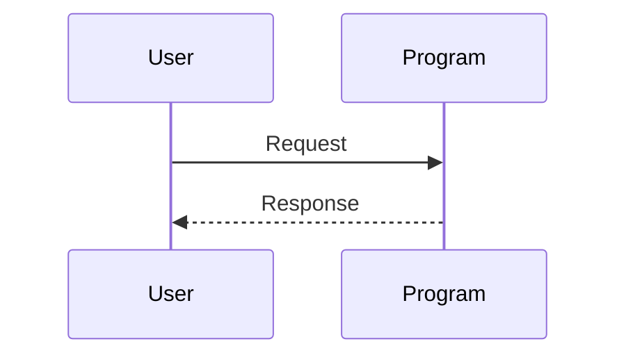
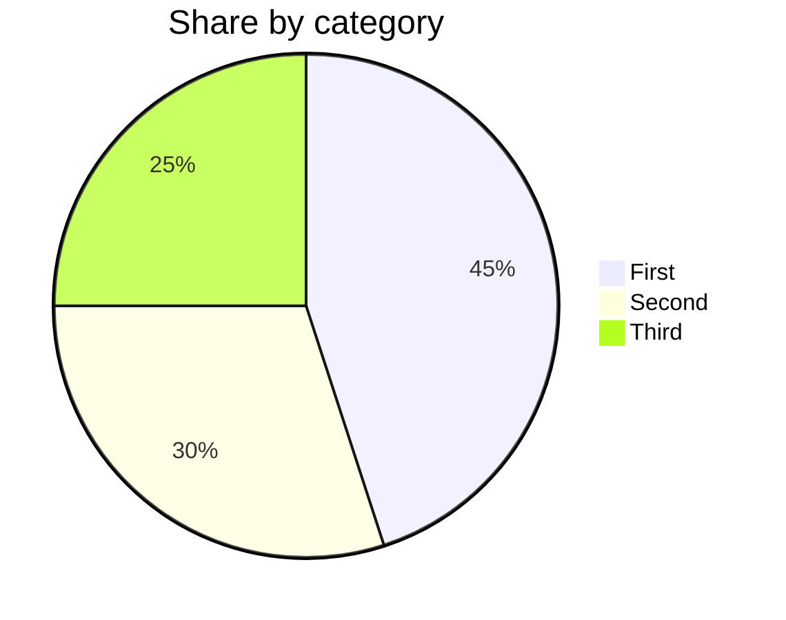

# Mermaid Sample

This sample shows the three most common Mermaid diagram kinds as fenced
code blocks. Press Alt+V in EdSharp to insert any of them from the
shipped snippets, answer the prompts, and preview the document in the
web browser to see the drawn diagrams. The block text itself is the
accessible view: each diagram reads as plain structured text.

## Flowchart

## Sequence diagram

## Pie chart

