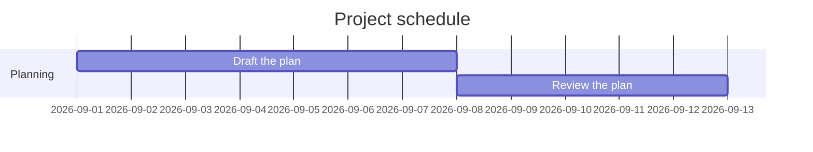

---
title: Gantt chart example
lang: en
---

# Gantt chart example

This is the shape the matching snippet inserts. It names itself, describes
itself, and sets no theme, so Check Markdown, Alt+F9, reports nothing.

